<div align="center">
  
<!-- Animated Header -->


<!-- Typing SVG -->
<a href="https://git.io/typing-svg"></a>

<br>

<!-- Profile Badges -->
<p align="center">
  <a href="https://github.com/Ali-hey-0?tab=followers">
    
  </a>
  
  
  
</p>

<!-- Focus Badges -->
<p align="center">
  
  
  
  
</p>

</div>

---

<!-- Navigation -->
<div align="center">

## 🧭 Quick Navigation

<table>
<tr>
<td align="center" width="16.66%">
<a href="#-about-me">

</a>
</td>
<td align="center" width="16.66%">
<a href="#-tech-arsenal">

</a>
</td>
<td align="center" width="16.66%">
<a href="#-github-analytics">

</a>
</td>
<td align="center" width="16.66%">
<a href="#-achievements">

</a>
</td>
<td align="center" width="16.66%">
<a href="#-featured-work">

</a>
</td>
<td align="center" width="16.66%">
<a href="#-connect-with-me">

</a>
</td>
</tr>
</table>

</div>

---

<!-- About Me Section -->
<div align="center">

## 👨‍💻 About Me


</div>

```typescript
interface Developer {
    name: string;
    role: string;
    location: string;
    currentFocus: string[];
    learning: string[];
    languages: LanguageSkills;
    expertise: TechStack;
    interests: Interests;
    values: string[];
}

const ali: Developer = {
    name: "Ali Heydari",
    role: "Full-Stack Software Engineer",
    location: "🌍 Earth • Open to Remote Opportunities",
    
    currentFocus: [
        "🤖 Building AI-powered SaaS applications",
        "🦀 Mastering Rust for high-performance systems",
        "☁️ Architecting scalable cloud solutions",
        "🔐 Implementing security-first development practices"
    ],
    
    learning: [
        "Advanced Deep Learning & Neural Architecture",
        "Rust Systems Programming & WebAssembly",
        "Cloud Architecture (AWS/Azure/GCP)",
        "Web3 Technologies & Smart Contracts",
        "Advanced Cybersecurity & Ethical Hacking"
    ],
    
    languages: {
        expert: ["JavaScript", "TypeScript", "Python"],
        proficient: ["PHP", "Go", "Rust", "SQL"],
        familiar: ["Kotlin", "C++", "Java"],
        learning: ["WebAssembly", "Solidity"]
    },
    
    expertise: {
        frontend: {
            core: ["React", "Next.js", "Vue.js"],
            styling: ["TailwindCSS", "Material-UI", "Styled-Components"],
            state: ["Redux", "Zustand", "React Query"],
            tools: ["Webpack", "Vite", "Babel"]
        },
        backend: {
            node: ["Express.js", "Nest.js", "Fastify"],
            python: ["FastAPI", "Django", "Flask"],
            rust: ["Actix-web", "Rocket", "Axum"],
            other: ["Go", "GraphQL", "gRPC"]
        },
        database: {
            sql: ["PostgreSQL", "MySQL", "SQLite"],
            noSql: ["MongoDB", "Redis", "Cassandra"],
            orm: ["Prisma", "TypeORM", "SQLAlchemy"],
            cloud: ["Firebase", "Supabase", "DynamoDB"]
        },
        aiMl: ["PyTorch", "TensorFlow", "Scikit-Learn", "Hugging Face", "OpenCV"],
        devOps: ["Docker", "Kubernetes", "GitHub Actions", "CI/CD", "Linux"],
        security: ["OWASP", "Penetration Testing", "Network Security", "Cryptography"]
    },
    
    interests: {
        technology: ["AI/ML", "Cybersecurity", "Cloud Computing", "Blockchain"],
        science: ["Neuroscience", "Biology", "Chemistry", "Physics"],
        data: ["Data Visualization", "Analytics", "Sports Analytics"],
        creative: ["Technical Writing", "UI/UX Design", "Open Source"]
    },
    
    values: [
        "Clean Code & Best Practices",
        "Continuous Learning & Growth",
        "Open Source Contribution",
        "Knowledge Sharing & Mentorship",
        "Security & Privacy First"
    ]
};

// My approach to development
const codePhilosophy = () => {
    return {
        design: "Simple, scalable, and maintainable",
        code: "Clean, tested, and documented",
        deploy: "Secure, monitored, and optimized",
        mindset: "Always learning, always improving"
    };
};
```

<div align="center">

### 🎯 Professional Highlights

<table>
<tr>
<td align="center" width="25%">

<br><strong>Experience</strong>
</td>
<td align="center" width="25%">

<br><strong>Tech Stack</strong>
</td>
<td align="center" width="25%">

<br><strong>Completed</strong>
</td>
<td align="center" width="25%">

<br><strong>Mindset</strong>
</td>
</tr>
</table>

</div>

---

<!-- Tech Stack Section -->
<div align="center">

## 💼 Tech Arsenal


</div>

### 🎨 Frontend Development

<div align="center">


</div>

### ⚙️ Backend & Systems Programming

<div align="center">


</div>

### 🗄️ Databases & Caching

<div align="center">


</div>

### 🤖 AI/ML & Data Science

<div align="center">


</div>

### ☁️ Cloud & DevOps

<div align="center">


</div>

### 🔒 Security & Testing

<div align="center">


</div>

### 🛠️ Development Tools

<div align="center">


</div>

---

<!-- GitHub Analytics Section -->
<div align="center">

## 📊 GitHub Analytics


</div>

<div align="center">

<!-- Stats Cards -->
<picture>
  <source media="(prefers-color-scheme: dark)" srcset="https://github-readme-stats.vercel.app/api?username=Ali-hey-0&show_icons=true&theme=tokyonight&hide_border=true&count_private=true&include_all_commits=true&rank_icon=github" />
  <source media="(prefers-color-scheme: light)" srcset="https://github-readme-stats.vercel.app/api?username=Ali-hey-0&show_icons=true&theme=default&hide_border=true&count_private=true&include_all_commits=true&rank_icon=github" />
  
</picture>

<picture>
  <source media="(prefers-color-scheme: dark)" srcset="https://github-readme-streak-stats.herokuapp.com/?user=Ali-hey-0&theme=tokyonight&hide_border=true&date_format=M%20j%5B%2C%20Y%5D" />
  <source media="(prefers-color-scheme: light)" srcset="https://github-readme-streak-stats.herokuapp.com/?user=Ali-hey-0&theme=default&hide_border=true&date_format=M%20j%5B%2C%20Y%5D" />
  
</picture>

</div>

<br>

<div align="center">

<!-- Language & Time Stats -->
<picture>
  <source media="(prefers-color-scheme: dark)" srcset="https://github-readme-stats.vercel.app/api/top-langs/?username=Ali-hey-0&theme=tokyonight&hide_border=true&layout=compact&langs_count=12&card_width=400" />
  <source media="(prefers-color-scheme: light)" srcset="https://github-readme-stats.vercel.app/api/top-langs/?username=Ali-hey-0&theme=default&hide_border=true&layout=compact&langs_count=12&card_width=400" />
  
</picture>

<picture>
  <source media="(prefers-color-scheme: dark)" srcset="https://github-profile-summary-cards.vercel.app/api/cards/productive-time?username=Ali-hey-0&theme=tokyonight&utcOffset=3.5" />
  <source media="(prefers-color-scheme: light)" srcset="https://github-profile-summary-cards.vercel.app/api/cards/productive-time?username=Ali-hey-0&theme=default&utcOffset=3.5" />
  
</picture>

</div>

<br>

<!-- Contribution Graph -->
<div align="center">

### 📈 Contribution Activity


</div>

<br>

<!-- GitHub Snake -->
<div align="center">

### 🐍 Contribution Snake

<picture>
  <source media="(prefers-color-scheme: dark)" srcset="https://raw.githubusercontent.com/Ali-hey-0/Ali-hey-0/output/github-contribution-grid-snake-dark.svg">
  <source media="(prefers-color-scheme: light)" srcset="https://raw.githubusercontent.com/Ali-hey-0/Ali-hey-0/output/github-contribution-grid-snake.svg">
  
</picture>

</div>

---

<!-- Achievements Section -->
<div align="center">

## 🏆 Achievements


</div>

---

<!-- Featured Projects Section -->
<div align="center">

## 🚀 Featured Work


</div>

<table>
  <tr>
    <td width="50%" valign="top">
      
### 🔍 [BarcodeScannerAPI](https://github.com/Ali-hey-0/BarcodeScannerAPI)

<a href="https://github.com/Ali-hey-0/BarcodeScannerAPI">
  
</a>

**High-Performance Computer Vision API**

Production-ready barcode scanning service built with modern technologies for real-time processing and seamless integration.

**Tech Stack:**
<br>


**Key Features:**
- ⚡ Real-time barcode detection
- 🎯 Multi-format support
- 🔄 RESTful API design
- 📦 Containerized deployment
- 🚀 High-performance processing

</td>
<td width="50%" valign="top">

### 🌟 Coming Soon


**🔨 In Development:**

<table>
<tr><td>

**🤖 AI Projects**
- Neural Network Visualizer
- ML Model Deployment Platform
- AI-Powered Code Assistant

</td></tr>
<tr><td>

**🦀 Rust Systems**
- CLI Performance Monitor
- WebAssembly Game Engine
- Distributed Task Queue

</td></tr>
<tr><td>

**🌐 Web Applications**
- Real-time Collaboration Tool
- SaaS Analytics Dashboard
- Progressive Web App Framework

</td></tr>
<tr><td>

**🔐 Security Tools**
- Vulnerability Scanner
- Network Traffic Analyzer
- Encryption Utility Suite

</td></tr>
</table>

</td>
  </tr>
</table>

<br>

<!-- Project Roadmap -->
<div align="center">

### 💡 Development Roadmap

```mermaid
graph TB
    A[🎯 2026 Focus Areas] --> B[🤖 AI & ML]
    A --> C[🌐 Web Development]
    A --> D[🔒 Cybersecurity]
    A --> E[🦀 Systems Programming]
    
    B --> B1[Deep Learning Models]
    B --> B2[Computer Vision Apps]
    B --> B3[NLP Solutions]
    B --> B4[MLOps Pipelines]
    
    C --> C1[Next.js Applications]
    C --> C2[Real-time Features]
    C --> C3[Microservices]
    C --> C4[Progressive Web Apps]
    
    D --> D1[Security Automation]
    D --> D2[Pen Testing Tools]
    D --> D3[Threat Intelligence]
    D --> D4[Secure Architecture]
    
    E --> E1[Rust CLI Tools]
    E --> E2[WebAssembly Modules]
    E --> E3[Performance Libraries]
    E --> E4[System Utilities]
    
    style A fill:#9333EA,stroke:#7C3AED,color:#fff
    style B fill:#FF6B6B,stroke:#E63946,color:#fff
    style C fill:#4ECDC4,stroke:#35A29F,color:#fff
    style D fill:#FFD93D,stroke:#F4C430,color:#000
    style E fill:#1A1B27,stroke:#000000,color:#fff
```



</div>

---

<!-- Skills & Expertise Section -->
<div align="center">

## 🎯 Expertise & Focus Areas

</div>

<table>
<tr>
<td width="33%" valign="top">

### 💻 Current Focus


- 🔭 **AI/ML Applications**
  - Deep learning models
  - Computer vision systems
  - Natural language processing

- 🦀 **Rust Development**
  - Systems programming
  - WebAssembly modules
  - High-performance APIs

- ☁️ **Cloud Architecture**
  - Scalable microservices
  - Serverless functions
  - Container orchestration

- 🔐 **Security Engineering**
  - Secure code practices
  - Penetration testing
  - Threat modeling

</td>
<td width="33%" valign="top">

### 📚 Learning Path


- 🎓 **Studying**
  - Advanced ML algorithms
  - Rust async programming
  - Cloud certifications
  - System design patterns

- 📖 **Reading**
  - *Designing Data-Intensive Apps*
  - *The Rust Programming Language*
  - *Deep Learning* by Goodfellow
  - *Clean Architecture*

- 🏗️ **Building**
  - Personal SaaS product
  - Open source contributions
  - Technical blog content
  - Portfolio projects

</td>
<td width="33%" valign="top">

### 🌟 Interests


- 🧬 **Science**
  - Neuroscience
  - Biology & biomimicry
  - Chemistry & materials
  - Medical technology

- 📊 **Analytics**
  - Data visualization
  - Sports analytics
  - Geographic data
  - Statistical modeling

- 🎨 **Creative**
  - UI/UX design
  - Technical writing
  - Content creation
  - Community building

</td>
</tr>
</table>

---

<!-- Goals & Vision Section -->
<div align="center">

## 🎯 2026 Vision & Goals


</div>

<table>
<tr>
<td width="50%" valign="top">

### 🚀 Technical Milestones

<table>
<tr><td>

**🎓 Certifications**
- [ ] AWS Solutions Architect
- [ ] Certified Ethical Hacker (CEH)
- [ ] Kubernetes Administrator (CKA)
- [ ] TensorFlow Developer

</td></tr>
<tr><td>

**💻 Master Technologies**
- [x] React & Next.js ecosystem
- [x] Python for AI/ML
- [ ] Rust systems programming
- [ ] Advanced Kubernetes
- [ ] WebAssembly development

</td></tr>
<tr><td>

**📦 Ship Products**
- [x] 1 production API
- [ ] 3+ web applications
- [ ] 1 SaaS product
- [ ] 5+ npm/cargo packages
- [ ] 2+ mobile apps

</td></tr>
<tr><td>

**🌟 Open Source**
- [ ] 10+ meaningful PRs
- [ ] Maintain 2+ projects
- [ ] 500+ GitHub stars
- [ ] Active contributor badge

</td></tr>
</table>

</td>
<td width="50%" valign="top">

### 🌱 Personal Development

<table>
<tr><td>

**✍️ Content Creation**
- [ ] 50+ blog posts
- [ ] YouTube channel launch
- [ ] Technical course creation
- [ ] Weekly newsletters
- [ ] Podcast appearances

</td></tr>
<tr><td>

**🤝 Community Impact**
- [ ] Speak at 2+ conferences
- [ ] Mentor 10+ developers
- [ ] Host tech workshops
- [ ] Build local tech community
- [ ] Contribute to education

</td></tr>
<tr><td>

**📚 Knowledge Growth**
- [ ] Read 24 technical books
- [ ] Complete 10+ courses
- [ ] Attend 5+ conferences
- [ ] Build 20+ projects
- [ ] Learn 2+ new languages

</td></tr>
<tr><td>

**⚖️ Work-Life Balance**
- [ ] Regular exercise routine
- [ ] Mindfulness practice
- [ ] Travel & exploration
- [ ] Creative hobbies
- [ ] Community involvement

</td></tr>
</table>

</td>
</tr>
</table>

<br>

<!-- Progress Tracker -->
<div align="center">

### 📊 2026 Progress Tracker

| Goal Category | Target | Current | Progress | Status |
|:--------------|:------:|:-------:|:--------:|:------:|
| **🚀 Projects Launched** | 5 | 1 |  | 🔥 In Progress |
| **📝 Blog Articles** | 50 | 3 |  | ✍️ Writing |
| **🤝 Open Source PRs** | 10 | 2 |  | 💪 Contributing |
| **🎓 Certifications** | 2 | 0 |  | 📚 Studying |
| **📚 Books Read** | 24 | 5 |  | 📖 Reading |
| **👥 Developers Mentored** | 10 | 3 |  | 🎯 Mentoring |

</div>

---

<!-- Philosophy Section -->
<div align="center">

## 💭 Development Philosophy


</div>

<table>
<tr>
<td width="60%" valign="top">

### 🌟 Core Principles

```rust
struct CodePhilosophy {
    design: &'static str,
    implementation: &'static str,
    testing: &'static str,
    deployment: &'static str,
    mindset: &'static str,
}

impl CodePhilosophy {
    fn new() -> Self {
        Self {
            design: "Simple, scalable, and maintainable",
            implementation: "Clean, tested, and documented",
            testing: "Comprehensive, automated, and reliable",
            deployment: "Secure, monitored, and optimized",
            mindset: "Always learning, always improving"
        }
    }
}

trait DeveloperMindset {
    fn write_code(&self) -> &str {
        "With purpose and clarity"
    }
    
    fn solve_problems(&self) -> &str {
        "With creativity and persistence"
    }
    
    fn collaborate(&self) -> &str {
        "With empathy and openness"
    }
    
    fn learn(&self) -> &str {
        "Continuously and passionately"
    }
}
```

### 🎨 Unique Approach

My interdisciplinary background fuels innovative solutions:

- **🧬 Biology** → Biomimetic algorithms & evolutionary optimization
- **⚗️ Chemistry** → Reaction modeling for distributed systems
- **🧠 Neuroscience** → Brain-inspired neural architectures
- **📊 Sports Analytics** → Data-driven decision frameworks
- **🌍 Geography** → Spatial computing & visualization

> *"The best code emerges at the intersection of science, creativity, and engineering discipline."*

</td>
<td width="40%" valign="center">


<br><br>

### ⚡ Developer Traits


<br>

<br>

<br>

<br>

<br>


</td>
</tr>
</table>

---

<!-- Status Section -->
<div align="center">

## 💼 Professional Status


<br><br>

### 🎯 Open to Opportunities In

<table>
<tr>
<td align="center" width="25%">
<br>
<strong>Web Development</strong>
</td>
<td align="center" width="25%">
<br>
<strong>Machine Learning</strong>
</td>
<td align="center" width="25%">
<br>
<strong>Rust Development</strong>
</td>
<td align="center" width="25%">
<br>
<strong>Cybersecurity</strong>
</td>
</tr>
</table>

</div>

---

<!-- Connect Section -->
<div align="center">

## 📫 Connect With Me


<br>

<a href="mailto:aliheydari1381doc@gmail.com">
  
</a>
<a href="https://linkedin.com/in/ali-heydari">
  
</a>
<a href="https://v1-artisan-ai-blog-le0gcynaxcvolwr-epspb.build-preview.cloudflare.dev">
  
</a>
<a href="https://github.com/Ali-hey-0">
  
</a>
<a href="https://twitter.com/ali_hey_0">
  
</a>

<br><br>

### 💌 Get In Touch

<table>
<tr>
<td align="center" width="33%">

**📧 Email**
<br>
[aliheydari1381doc@gmail.com](mailto:aliheydari1381doc@gmail.com)
<br><br>
*For professional inquiries*

</td>
<td align="center" width="33%">

**💼 LinkedIn**
<br>
[Ali Heydari](https://linkedin.com/in/ali-heydari)
<br><br>
*Let's connect professionally*

</td>
<td align="center" width="33%">

**📝 Blog**
<br>
[Tech Journey](https://v1-artisan-ai-blog-le0gcynaxcvolwr-epspb.build-preview.cloudflare.dev)
<br><br>
*Read my thoughts & tutorials*

</td>
</tr>
</table>

<br>

### 🤝 Let's Build Something Amazing!

**I'm passionate about collaborating on:**

🤖 **AI/ML Projects** • 🌐 **Full-Stack Applications** • 🦀 **Rust Systems** • 🔒 **Security Tools** • 📱 **Mobile Apps** • 💡 **Innovative Startups** • 🎓 **EdTech Solutions** • 🌍 **Open Source**

<br>

**Have a project idea? Want to collaborate? Just want to chat about tech?**


</div>

---

<!-- Quote Section -->
<div align="center">

## 💭 Daily Inspiration


</div>

---

<!-- WakaTime Section -->
<div align="center">

## 📊 Weekly Coding Activity

<!--START_SECTION:waka-->
<!--END_SECTION:waka-->

<sub>*Powered by WakaTime*</sub>

</div>

---

<!-- Support Section -->
<div align="center">

## ☕ Support My Work

If you find my projects helpful or appreciate my open-source contributions, consider supporting my work!

<a href="https://www.buymeacoffee.com/aliheydari">
  
</a>
<a href="https://ko-fi.com/aliheydari">
  
</a>

<br><br>

*Your support helps me create more open-source projects and educational content!* ❤️

</div>

---

<!-- Footer -->
<div align="center">


<br>

### 🌟 "The best code is written with passion, refined with discipline, and shared with generosity."

<br>


<br><br>


<br>

<table>
<tr>
<td align="center">

</td>
<td align="center">

</td>
<td align="center">

</td>
<td align="center">

</td>
</tr>
</table>

<br>

**⭐️ From [Ali-hey-0](https://github.com/Ali-hey-0) | Last Updated: January 2026 | Made with 💜 in Markdown**

<br>


</div>
