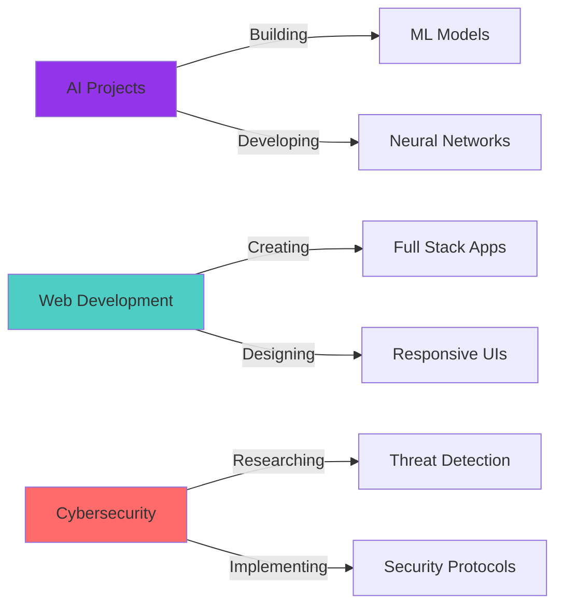

<div align="center">
  
  <!-- Animated Header with Custom Gradient -->
  

  <!-- Animated Typing Effect with Multiple Lines -->
  

  <br>

  <!-- Animated Badge Collection -->
  
  
  
  

  <br><br>

  <!-- Profile Views & Social Stats -->
  
  [](https://github.com/Ali-hey-0?tab=followers)
  [](https://github.com/Ali-hey-0?tab=stars)
  [](https://github.com/Ali-hey-0)
  [](https://github.com/Ali-hey-0?tab=repositories)
  [](https://github.com/Ali-hey-0)

</div>

---

<div align="center">

## 🎯 Quick Navigation

**[👨‍💻 About Me](#-about-me)** • 
**[💼 Tech Stack](#-tech-stack)** • 
**[📊 GitHub Analytics](#-github-analytics)** • 
**[🏆 Achievements](#-achievements)** • 
**[🚀 Projects](#-featured-projects)** • 
**[📈 Activity](#-contribution-activity)** • 
**[🌐 Connect](#-lets-connect)**

</div>

---

<div align="center">

## 👨‍💻 About Me

</div>

```typescript
const ali = {
    pronouns: "He" | "Him",
    location: "🌍 Earth, Solar System",
    code: ["TypeScript", "JavaScript", "Python", "PHP", "Go"],
    technologies: {
        frontEnd: {
            js: ["React", "Next.js"],
            css: ["Bootstrap", "Material-UI", "Tailwind CSS"]
        },
        backEnd: {
            js: ["Node.js", "Express"],
            python: ["TensorFlow", "PyTorch"],
            misc: ["PHP", "Go"]
        },
        databases: ["MongoDB", "MySQL", "PostgreSQL", "Redis"],
        devOps: ["Docker", "Linux", "Git", "Bash"],
        ai: ["Machine Learning", "Deep Learning", "NLP", "Computer Vision"],
        cybersecurity: ["Kali Linux", "Penetration Testing", "Network Security"]
    },
    currentFocus: "Building AI-powered applications with security in mind",
    funFact: "I debug with console.log() and I'm not ashamed! 🐛",
    challenge: "I'm doing #100DaysOfCode and learning new things every day!"
};
```

<div align="center">

### 🎓 Education & Certifications


</div>

---

<div align="center">

## 💼 Tech Stack

### 🎨 Frontend Development


### ⚙️ Backend Development


### 🗄️ Databases & Cloud


### 🤖 AI & Machine Learning


### 🛠️ DevOps & Tools


### 🔒 Cybersecurity


</div>

---

<div align="center">

## 📊 GitHub Analytics

<details open>
<summary><b>📈 Comprehensive Stats</b></summary>
<br>

<table width="100%">
  <tr>
    <td width="50%">
      
    </td>
    <td width="50%">
      
    </td>
  </tr>
</table>


<table width="100%">
  <tr>
    <td width="50%">
      
    </td>
    <td width="50%">
      
    </td>
  </tr>
</table>

</details>

<details open>
<summary><b>🔥 Recent Activity</b></summary>
<br>

<!--START_SECTION:activity-->
<!--END_SECTION:activity-->


</details>

</div>

---

<div align="center">

## 🏆 Achievements


### 🎯 GitHub Metrics


</div>

---

<div align="center">

## 🚀 Featured Projects

<table width="100%">
  <tr>
    <td width="50%">
      <a href="https://github.com/Ali-hey-0/BarcodeScannerAPI">
        
      </a>
      <p align="center">
        
        
        
      </p>
    </td>
    <td width="50%">
      <!-- Add your second featured project here -->
      <a href="https://github.com/Ali-hey-0">
        
      </a>
      <p align="center">
        
        
      </p>
    </td>
  </tr>
</table>

### 💡 What I'm Working On



</div>

---

<div align="center">

## 📈 Contribution Activity


### 📅 Contribution Heatmap


</div>

---

<div align="center">

## 🌟 Skills & Interests

<table>
  <tr>
    <td valign="top" width="33%">

### 🎯 Current Focus
- 🔭 Working on **AI-powered applications**
- 🌱 Learning **Advanced Machine Learning**
- 👯 Looking to collaborate on **Open Source Projects**
- 🤔 Exploring **Web3 & Blockchain**
- 💬 Ask me about **Full Stack Development**
- ⚡ Fun fact: **I love debugging at 3 AM**

</td>
<td valign="top" width="33%">

### 🎨 Interests
- 🌍 **Geography** - Exploring world cultures
- 🧬 **Biology** - Understanding life sciences  
- ⚗️ **Chemistry** - Chemical reactions fascinate me
- ⚽ **Football** - Strategic gameplay analysis
- 📺 **TV Series** - Storytelling & cinematography
- 💊 **Pharmacy** - Medical science applications

</td>
<td valign="top" width="33%">

### 🧠 Research Areas
- 🤖 **Artificial Intelligence**
- 🔐 **Cybersecurity**
- 🌐 **Distributed Systems**
- 📊 **Data Science**
- 🎯 **Algorithm Optimization**
- 🧬 **Bioinformatics**

</td>
  </tr>
</table>

</div>

---

<div align="center">

## 💭 Random Dev Quote


## 😂 Here's a Random Joke


</div>

---

<div align="center">

## 🌐 Let's Connect

<a href="mailto:aliheydari1381doc@gmail.com">
  
</a>
<a href="https://linkedin.com/in/ali-heydari">
  
</a>
<a href="https://v1-artisan-ai-blog-le0gcynaxcvolwr-epspb.build-preview.cloudflare.dev">
  
</a>
<a href="https://twitter.com/ali-heydari">
  
</a>
<a href="https://stackoverflow.com/users/ali-heydari">
  
</a>
<a href="https://dev.to/ali-heydari">
  
</a>
<a href="https://medium.com/@ali-heydari">
  
</a>
<a href="https://discord.com/users/ali-heydari">
  
</a>

<br><br>

### 💼 Open for Opportunities


<br>

📧 **Email:** [aliheydari1381doc@gmail.com](mailto:aliheydari1381doc@gmail.com)  
💼 **LinkedIn:** [linkedin.com/in/ali-heydari](https://linkedin.com/in/ali-heydari)  
🌐 **Portfolio:** Coming Soon  
📝 **Blog:** [My Tech Blog](https://v1-artisan-ai-blog-le0gcynaxcvolwr-epspb.build-preview.cloudflare.dev)

</div>

---

<div align="center">

## 💖 Support My Work

<a href="https://www.buymeacoffee.com/aliheydari">
  
</a>
<a href="https://ko-fi.com/aliheydari">
  
</a>
<a href="https://paypal.me/aliheydari">
  
</a>

If you find my projects helpful or interesting, consider supporting my work! ☕️

</div>

---

<div align="center">

### 🎯 My Goals for 2025

```yaml
Professional:
  - Master: ["Advanced AI/ML", "Cloud Architecture", "System Design"]
  - Build: ["10+ Open Source Projects", "Personal SaaS Product"]
  - Contribute: ["Major Open Source Repositories"]
  - Learn: ["Rust", "Kubernetes", "WebAssembly"]
  
Personal:
  - Read: "24 Technical Books"
  - Write: "50+ Blog Posts"
  - Mentor: "Junior Developers"
  - Speak: "At Tech Conferences"
```

</div>

---

<div align="center">

## 📚 Latest Blog Posts

<!-- BLOG-POST-LIST:START -->
<!-- BLOG-POST-LIST:END -->

</div>

---

<div align="center">

### ⚡ Fun Fact About Me

<table>
  <tr>
    <td>
      
    </td>
    <td valign="center">
      
**When I'm not coding, you can find me:**
- 🌍 Exploring geography and world cultures
- 🧬 Reading about biology and brain function
- ⚗️ Conducting chemistry experiments (safely!)
- ⚽ Analyzing football strategies
- 📺 Binge-watching the latest tech documentaries
- 💊 Learning about pharmacy and medicine

*These diverse interests fuel my creativity and problem-solving in tech!*

</td>
  </tr>
</table>

</div>

---

<div align="center">

### 📊 Weekly Development Breakdown

<!--START_SECTION:waka-->
<!--END_SECTION:waka-->

</div>

---

<div align="center">

## 🎉 Thanks for Visiting!


<p>
  
  
  
</p>

**"Code is like humor. When you have to explain it, it's bad." – Cory House**


</div>
