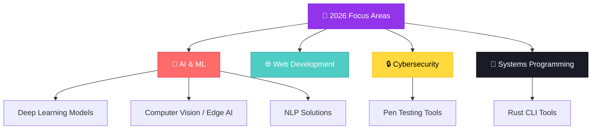

<div align="center">


# 👨‍💻 Ali Heydari

**Backend Developer & AI Enthusiast** | Python · Node.js · FastAPI · Cybersecurity

[](mailto:aliheydari1381doc@gmail.com)
[](https://linkedin.com/in/ali-heydari)
[](https://abedini.me/fa/)
[](https://github.com/Ali-hey-0)
[](https://twitter.com/ali_hey_0)

</div>

---

## 👋 About Me

```typescript
const ali: Developer = {
  name: "Ali Heydari",
  role: "Full-Stack Software Engineer",
  location: "🌍 Earth • Open to Remote Opportunities",

  currentFocus: [
    "🤖 Building AI-powered SaaS applications",
    "🦀 Mastering Rust for high-performance systems",
    "☁️ Architecting scalable cloud solutions",
    "🔐 Implementing security-first development practices",
  ],

  learning: [
    "Advanced Deep Learning & Neural Architecture",
    "Rust Systems Programming",
    "Web3 Technologies & Smart Contracts",
    "Advanced Cybersecurity & Ethical Hacking",
  ],

  languages: {
    expert: ["JavaScript", "Python"],
    proficient: ["PHP", "Rust", "SQL", "C#"],
  },

  expertise: {
    frontend: ["React"],
    backend: {
      node: ["Express.js"],
      python: ["FastAPI"],
      dotnet: ["Blazor", ".NET MAUI"],
    },
    database: {
      sql: ["PostgreSQL", "MySQL", "SQLite"],
      noSql: ["MongoDB"],
      orm: ["Prisma"],
    },
    aiMl: ["PyTorch", "TensorFlow", "Scikit-Learn", "Hugging Face", "OpenCV", "YOLOv8 (Edge AI)"],
    devOps: ["Docker", "GitHub Actions", "Linux"],
    security: ["OWASP", "Penetration Testing", "Network Security", "Cryptography"],
  },

  interests: {
    technology: ["AI/ML", "Embedded & IoT (BLE, microcontrollers)"],
    science: ["Neuroscience", "Biology", "Chemistry", "Physics"],
    data: ["Data Visualization", "Analytics", "Sports Analytics"],
    creative: ["Technical Writing", "Open Source"],
  },
};

const codePhilosophy = () => ({
  design: "Simple, scalable, and maintainable",
  code: "Clean, tested, and documented",
  deploy: "Secure, monitored, and optimized",
  mindset: "Always learning, always improving",
});
```

---

## 🛠️ Tech Stack

<div align="center">


</div>

---

## 🚀 Projects

> ℹ️ **How to add a new project:** copy the template row at the bottom of the table, fill in the name, description, tech badges, and whichever links apply (Live Demo and/or Source Code — use `—` for whichever doesn't apply, e.g. `🔒 Private` if the code isn't public), then paste it back into the table. One row per project keeps things tidy and easy to scan.

| Project | Description | Tech | Live Demo | Source Code |
|---|---|---|---|---|
| 📝 **Personal Blog** | My personal blog, where I write about my technical journey, projects, and ideas. |  | [Visit](https://abedini.me/fa/) | — |
| 🏭 **Arka Industrial** | Industrial e-commerce platform for Arka Industrial — currently running on staging ahead of its move to the production domain. |   | [Visit (staging)](https://staging.arkaindustrial.com/) | — |
| 💼 **AdvanceAccounting** | Windows desktop accounting application for managing business bookkeeping and finances. |    | — | 🔒 Private |
| ♻️ **Yolo8n_AI_doc** | A YOLOv8n-based object-detection model — together with a full benchmarking & evaluation methodology — for sorting waste on an edge microcontroller along a production line. |    | — | [Repo](https://github.com/Ali-hey-0/Yolo8n_AI_doc) |
| ⚖️ **bluetooth_ble_app_weight** | A .NET MAUI app that connects to a microcontroller-based sensor over Bluetooth LE and displays incoming weight readings live, in real time. |    | — | [Repo](https://github.com/Ali-hey-0/bluetooth_ble_app_weight) |
| 🔍 **BarcodeScannerAPI** | High-performance computer-vision API for real-time barcode scanning. |     | — | [Repo](https://github.com/Ali-hey-0/BarcodeScannerAPI) |
| 🌦️ **forecast-fusion** | Multivariate weather forecasting using Transformers and FastAPI, with real-time predictions and interactive visualization. |   | — | [Repo](https://github.com/Ali-hey-0/forecast-fusion) |
| 📚 **DeepLearning-YouTube** | Companion notebooks for a Deep Learning course series on YouTube. |  | — | [Repo](https://github.com/Ali-hey-0/DeepLearning-YouTube) |
| 🛡️ **Hacking-Tools** | A collection of network-security and offensive-security documentation, scripts, and tooling. |  | — | [Repo](https://github.com/Ali-hey-0/Hacking-Tools) |
| 📝 **MyBlog** | Source code for a personal blog built from scratch. |  | — | [Repo](https://github.com/Ali-hey-0/MyBlog) |
| ➕ *Your next project* | *Short one-line description of what it does and why it's interesting.* | *Badges for the stack used* | *Live URL or —* | *Repo URL or 🔒 Private* |

</div>

---

## 🗺️ Development Roadmap


```mermaid
graph TB
    A[🎯 2026 Focus Areas] --> B[🤖 AI & ML]
    A --> C[🌐 Web Development]
    A --> D[🔒 Cybersecurity]
    A --> E[🦀 Systems Programming]

    B --> B1[Deep Learning Models]
    B --> B2[Computer Vision / Edge AI]
    B --> B3[NLP Solutions]

    D --> D1[Pen Testing Tools]

    E --> E1[Rust CLI Tools]

    style A fill:#9333EA,stroke:#7C3AED,color:#fff
    style B fill:#FF6B6B,stroke:#E63946,color:#fff
    style C fill:#4ECDC4,stroke:#35A29F,color:#fff
    style D fill:#FFD93D,stroke:#F4C430,color:#000
    style E fill:#1A1B27,stroke:#000000,color:#fff
```

---

## 🌱 Goals & Personal Development

<table>
<tr>
<td width="50%" valign="top">

**💻 Master Technologies**
- [x] React
- [x] Python for AI/ML
- [x] .NET (Blazor / MAUI)
- [ ] Rust systems programming

**📦 Ship Products**
- [x] 1 production API
- [x] 1 production desktop app
- [ ] 3+ web applications
- [ ] 5+ npm/cargo packages

</td>
<td width="50%" valign="top">

**🎨 Unique Approach**

My interdisciplinary background fuels innovative solutions:
- **🧬 Biology** → Biomimetic algorithms & evolutionary optimization
- **⚗️ Chemistry** → Reaction modeling for distributed systems
- **🧠 Neuroscience** → Brain-inspired neural architectures
- **📊 Sports Analytics** → Data-driven decision frameworks

</td>
</tr>
</table>

---

## 📊 GitHub Stats

<div align="center">


<br>


<br><br>


</div>

---

## 💼 Professional Status

<div align="center">


</div>

---

## 📫 Connect With Me

<div align="center">


<br>

[](mailto:aliheydari1381doc@gmail.com)
[](https://linkedin.com/in/ali-heydari)
[](https://abedini.me/fa/)
[](https://github.com/Ali-hey-0)
[](https://twitter.com/ali_hey_0)

</div>

| | |
|---|---|
| 📧 **Email** | [aliheydari1381doc@gmail.com](mailto:aliheydari1381doc@gmail.com) — for professional inquiries |
| 💼 **LinkedIn** | [Ali Heydari](https://linkedin.com/in/ali-heydari) — let's connect professionally |
| 📝 **Blog** | [abedini.me/fa](https://abedini.me/fa/) — my thoughts & tutorials |

---

<div align="center">

## 💭 Daily Inspiration


### 🌟 *"The best code is written with passion, refined with discipline, and shared with generosity."*

<br>


<br>


**⭐️ From [Ali-hey-0](https://github.com/Ali-hey-0) | Made with 💜 in Markdown**


</div>
