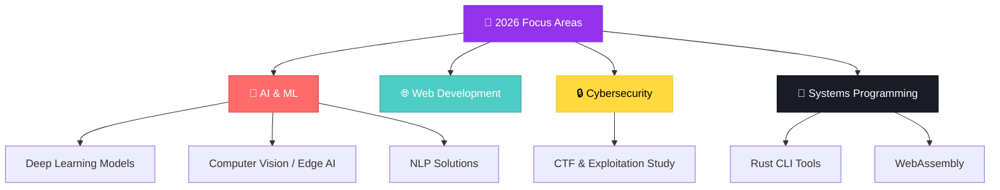

<div align="center">


# 👨‍💻 Ali Heydari

**Full-Stack Software Engineer & AI Enthusiast** | Python · Node.js · .NET/Blazor · FastAPI · Edge AI

[](mailto:aliheydari1381doc@gmail.com)
[](https://linkedin.com/in/ali-heydari)
[](https://abedini.me/fa/)
[](https://github.com/Ali-hey-0)
[](https://twitter.com/ali_hey_0)

<br>


</div>

---

## 📊 GitHub Stats

<div align="center">


<br>


<br>


</div>

---

## 👋 About Me

```typescript
const ali: Developer = {
  name:     "Ali Heydari",
  role:     "Full-Stack Software Engineer",
  location: "🌍 Earth  ·  Open to Remote",

  focus: [
    "🤖 AI-powered SaaS & Edge ML deployment",
    "🦀 Rust for high-performance systems",
    "🔐 Security-first engineering practices",
  ],

  stack: {
    languages: ["JavaScript", "Python", "C#", "Go", "Rust", "PHP"],
    backend:   ["Node.js/Express", "FastAPI", "Blazor", ".NET MAUI"],
    database:  ["PostgreSQL", "MongoDB", "MySQL", "SQLite", "Prisma"],
    ai_ml:     ["PyTorch", "TensorFlow", "OpenCV", "YOLOv8", "Hugging Face"],
    devOps:    ["Docker", "GitHub Actions", "Linux"],
    security:  ["OWASP", "Pen Testing", "Network Security", "Cryptography"],
  },

  learning:  ["Rust Systems Programming", "Advanced Deep Learning", "Web3"],
  principle: "Simple · Tested · Secure · Always improving",
};
```

---

## 🛠️ Tech Stack

<div align="center">

**Languages**


**Frameworks & Backend**


**Databases & DevOps**


**AI / ML**


</div>

---

## 🚀 Featured Projects

<!-- ──────────────────────────────────────────────────────────────────
     HOW TO ADD A PROJECT:
     Copy any row from the relevant table below, fill in:
       - Name (bold, with emoji)
       - One-line description
       - Tech badges  →  
       - Live Demo    →  [Visit](URL)  or  —
       - Source Code  →  [Repo](URL)  or  🔒 Private
     Keep one row per project. Column order must match the header.
──────────────────────────────────────────────────────────────────── -->

### 🌐 Web & Full-Stack

| Project | Description | Tech | Live Demo | Source |
|---|---|---|---|---|
| 📝 **Personal Blog** | Technical journey, project write-ups, and ideas. |  | [Visit](https://abedini.me/fa/) | [Repo](https://github.com/Ali-hey-0/MyBlog) |
| 🏭 **Arka Industrial** | Industrial e-commerce platform — staging, moving to production soon. |  | [Staging](https://staging.arkaindustrial.com/) | — |
| 🌌 **Simulation** | Interactive 3D visualization of the universe across 65 orders of magnitude — quantum (10⁻³⁵) to cosmic (10⁺³⁰) — with real-time physics. |   | — | [Repo](https://github.com/Ali-hey-0/Simulation) |
| 🏫 **EduPortal** | School management website with PHP and MySQL. |   | — | [Repo](https://github.com/Ali-hey-0/php-website) |

### 🖥️ Desktop & Mobile (.NET)

| Project | Description | Tech | Live Demo | Source |
|---|---|---|---|---|
| 💼 **AdvanceAccounting** | Windows desktop accounting application for business bookkeeping and finances. |    | — | 🔒 Private |
| ⚖️ **BLE Weight Terminal** | .NET MAUI app — connects to an HC-08/HM-10 BLE sensor and streams live weight readings with auto-reconnect and CSV logging. |    | — | [Repo](https://github.com/Ali-hey-0/bluetooth_ble_app_weight) |

### 🤖 AI / ML & Edge AI

| Project | Description | Tech | Live Demo | Source |
|---|---|---|---|---|
| ♻️ **Yolo8n Edge Benchmark** | YOLOv8n evaluation framework for waste-sorting on a Rockchip NPU — covers latency, model size, thermal robustness, and per-class metrics. Ships `.pt` + `.onnx` + `.rknn` artifacts. |    | — | [Repo](https://github.com/Ali-hey-0/Yolo8n_AI_doc) |
| 🌦️ **forecast-fusion** | Multivariate weather forecasting with Transformers + FastAPI — real-time predictions and interactive visualization. |   | — | [Repo](https://github.com/Ali-hey-0/forecast-fusion) |
| 🩻 **Chest X-Ray Classifier** | Deep learning web app classifying chest X-rays (COVID-19 / Normal / Pneumonia) with Grad-CAM visualization. |   | — | [Repo](https://github.com/Ali-hey-0/radiography-xray-classifier) |

### 🖥️ Developer Tooling (Codex)

| Project | Description | Tech | Live Demo | Source |
|---|---|---|---|---|
| 🔬 **Aion** | Research platform investigating multi-profile isolation for OpenAI Codex Desktop — Tauri + Rust + React app with an extensive, honestly-documented reverse-engineering log. |    | — | [Repo](https://github.com/Ali-hey-0/Aion) |
| ⚡ **Codex-Account-Selector** | Zero-dependency Windows batch file that launches multiple fully-isolated Codex instances side by side. |  | — | [Repo](https://github.com/Ali-hey-0/Codex-Account-Selector) |

### 🔧 Tools & Utilities

| Project | Description | Tech | Live Demo | Source |
|---|---|---|---|---|
| 📡 **RSS Aggregator** | Full REST API for aggregating RSS feeds — register sources, follow, consume posts. Go + PostgreSQL + Docker. |    | — | [Repo](https://github.com/Ali-hey-0/GO-Practice) |
| 🔍 **BarcodeScannerAPI** | Node.js barcode scanning service — robust processing and easy integration for any app needing barcode recognition. |   | — | [Repo](https://github.com/Ali-hey-0/BarcodeScannerAPI) |
| 🔐 **CryptoVault Pro** | File encryption/decryption shipped as both a Python GUI app and a low-level x86-64 Assembly implementation. |   | — | [Python](https://github.com/Ali-hey-0/pycryptovault) · [ASM](https://github.com/Ali-hey-0/Assembly-File-Encryption) |
| 🔲 **QRception** | Fast QR code generator in C. |  | — | [Repo](https://github.com/Ali-hey-0/QRception) |

### 📚 Educational Content

| Project | Description | Tech | Link |
|---|---|---|---|
| 🎓 **DeepLearning-YouTube** | Companion notebooks for a Deep Learning course series on YouTube. |  | [Repo](https://github.com/Ali-hey-0/DeepLearning-YouTube) |
| 🦀 **Rust_Roadmap** | Hands-on Rust learning path — fundamentals to networking, async, macros, and system design. |  | [Repo](https://github.com/Ali-hey-0/Rust_Roadmap) |
| 🐹 **Go_Explain** | Practical Go tutorial covering concurrency, idiomatic patterns, and fundamentals — includes a Persian (فارسی) README. |  | [Repo](https://github.com/Ali-hey-0/Go_Explain) |

<div align="center">

<a href="https://github.com/Ali-hey-0/Simulation">
  
</a>
<a href="https://github.com/Ali-hey-0/forecast-fusion">
  
</a>
<a href="https://github.com/Ali-hey-0/Yolo8n_AI_doc">
  
</a>
<a href="https://github.com/Ali-hey-0/GO-Practice">
  
</a>

</div>

---

<details>
<summary><h2 style="display:inline;">🛡️ Security Research & CTF</h2></summary>

> Defensive-security and CTF-style learning — training labs, wargame walkthroughs, and a structured exploitation-curriculum roadmap. No attack tooling, no unauthorized-access content.

| Project | Description | Link |
|---|---|---|
| 🛡️ **owasp** | OWASP-based security training & penetration-testing lab. | [Repo](https://github.com/Ali-hey-0/owasp) |
| 💣 **nightmare-exploit-roadmap** | Structured binary-exploitation curriculum: stack, heap, mitigations, ROP, automated exploitation. | [Repo](https://github.com/Ali-hey-0/nightmare-exploit-roadmap) |
| 🔑 **NatasPasswordCracker** | Walkthrough/solver for the Natas web-security wargame (OverTheWire). | [Repo](https://github.com/Ali-hey-0/NatasPasswordCracker) |

</details>

<details>
<summary><h2 style="display:inline;">📖 Learning Resources & Inspiration</h2></summary>

> Repositories imported from other authors to study, reference, or build on — not original work, kept here as a personal library.

| Resource | Original Author | What it's for | Link |
|---|---|---|---|
| LLMs-from-scratch | [rasbt](https://github.com/rasbt) | Implementing a ChatGPT-like LLM in PyTorch from scratch. | [Repo](https://github.com/Ali-hey-0/LLMs-from-scratch) |
| 🤗 datasets | [huggingface](https://github.com/huggingface) | Hub of ready-to-use datasets for AI models. | [Repo](https://github.com/Ali-hey-0/datasets) |
| TensorTrade | [tensortrade-org](https://github.com/tensortrade-org) | RL framework for training algorithmic trading agents. | [Repo](https://github.com/Ali-hey-0/TensorTrade-with-Reinforcement-Learning) |
| heroui | [heroui-inc](https://github.com/heroui-inc) | Modern React UI library (formerly NextUI). | [Repo](https://github.com/Ali-hey-0/heroui) |
| awesome-llm-apps | [Shubhamsaboo](https://github.com/Shubhamsaboo) | Collection of LLM apps with AI Agents and RAG. | [Repo](https://github.com/Ali-hey-0/awesome-llm-apps) |
| Awesome-Hacking | [Hack-with-Github](https://github.com/Hack-with-Github) | Curated lists for hackers, pentesters & security researchers. | [Repo](https://github.com/Ali-hey-0/Awesome-Hacking) |
| awesome-courses | [prakhar1989](https://github.com/prakhar1989) | List of awesome university CS courses. | [Repo](https://github.com/Ali-hey-0/awesome-courses) |
| awesome-interview-questions | [DopplerHQ](https://github.com/DopplerHQ) | Curated interview-question lists. | [Repo](https://github.com/Ali-hey-0/awesome-interview-questions) |
| DALI | [NVIDIA](https://github.com/NVIDIA) | GPU-accelerated data-loading library for deep learning. | [Repo](https://github.com/Ali-hey-0/DALI) |
| practical-tutorials | [jderazoa](https://github.com/jderazoa) | Curated list of project-based tutorials. | [Repo](https://github.com/Ali-hey-0/practical-tutorials-project-based-learning) |
| Qiskit | [Qiskit](https://github.com/Qiskit) | Open-source SDK for quantum computing. | [Repo](https://github.com/Ali-hey-0/Qiskit) |
| opencv | [opencv](https://github.com/opencv) | Open Source Computer Vision Library. | [Repo](https://github.com/Ali-hey-0/opencv) |
| Models-Master | [tensorflow](https://github.com/tensorflow) | Models and examples built with TensorFlow. | [Repo](https://github.com/Ali-hey-0/Models-Master) |
| deep-learning-with-pytorch | [mrdbourke](https://github.com/mrdbourke) | "Learn PyTorch for Deep Learning: Zero to Mastery" course materials. | [Repo](https://github.com/Ali-hey-0/deep-learning-with-pytorch) |
| Freqtrade | [freqtrade](https://github.com/freqtrade) | Open-source crypto trading bot. | [Repo](https://github.com/Ali-hey-0/Freqtrade) |
| Bullet-Physics-SDK | [bulletphysics](https://github.com/bulletphysics) | Real-time collision detection & physics simulation SDK. | [Repo](https://github.com/Ali-hey-0/Bullet-Physics-SDK) |
| EvoSynth | [dongdongunique](https://github.com/dongdongunique) | Evolutionary-synthesis reference project. | [Repo](https://github.com/Ali-hey-0/EvoSynth) |

</details>

---

## 🗺️ 2026 Roadmap


```mermaid
graph TB
    A[🎯 2026 Focus Areas] --> B[🤖 AI & ML]
    A --> C[🌐 Web Development]
    A --> D[🔒 Cybersecurity]
    A --> E[🦀 Systems Programming]

    B --> B1[Deep Learning Models]
    B --> B2[Computer Vision / Edge AI]
    B --> B3[NLP Solutions]

    D --> D1[CTF & Exploitation Study]

    E --> E1[Rust CLI Tools]
    E --> E2[WebAssembly]

    style A fill:#9333EA,stroke:#7C3AED,color:#fff
    style B fill:#FF6B6B,stroke:#E63946,color:#fff
    style C fill:#4ECDC4,stroke:#35A29F,color:#fff
    style D fill:#FFD93D,stroke:#F4C430,color:#000
    style E fill:#1A1B27,stroke:#000000,color:#fff
```

---

## 🎨 Unique Approach

My interdisciplinary background directly shapes how I design systems:

| Domain | Applied to |
|---|---|
| 🧬 **Biology** | Biomimetic algorithms & evolutionary optimization |
| ⚗️ **Chemistry** | Reaction-rate modeling for distributed systems & backpressure |
| 🧠 **Neuroscience** | Brain-inspired neural architectures & attention mechanisms |
| 📊 **Sports Analytics** | Data-driven decision frameworks & probabilistic modeling |

**Shipped so far:**


---

<div align="center">


<br>

### 🌟 *"The best code is written with passion, refined with discipline, and shared with generosity."*

<br>


**⭐️ From [Ali-hey-0](https://github.com/Ali-hey-0) — Made with 💜 in Markdown**


</div>
