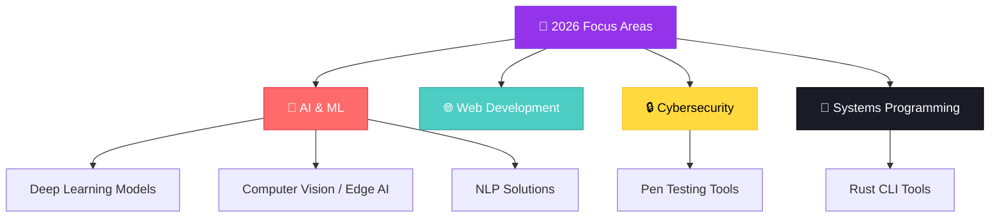

<div align="center">


# 👨‍💻 Ali Heydari

**Full-Stack Software Engineer & AI Enthusiast** | Python · Node.js · .NET/Blazor · FastAPI · Edge AI

[](https://github.com/Ali-hey-0?tab=followers)
[](https://github.com/Ali-hey-0?tab=repositories)

[](mailto:aliheydari1381doc@gmail.com)
[](https://linkedin.com/in/ali-heydari)
[](https://abedini.me/fa/)
[](https://github.com/Ali-hey-0)
[](https://twitter.com/ali_hey_0)

</div>

---

## 👋 About Me

```typescript
const ali: Developer = {
  name: "Ali Heydari",
  role: "Full-Stack Software Engineer",
  location: "🌍 Earth • Open to Remote Opportunities",

  currentFocus: [
    "🤖 Building AI-powered SaaS applications",
    "🦀 Mastering Rust for high-performance systems",
    "☁️ Architecting scalable cloud solutions",
    "🔐 Implementing security-first development practices",
  ],

  learning: [
    "Advanced Deep Learning & Neural Architecture",
    "Rust Systems Programming",
    "Web3 Technologies & Smart Contracts",
    "Advanced Cybersecurity & Ethical Hacking",
  ],

  languages: {
    expert: ["JavaScript", "Python"],
    proficient: ["PHP", "Rust", "SQL", "C#"],
  },

  expertise: {
    frontend: ["React"],
    backend: {
      node: ["Express.js"],
      python: ["FastAPI"],
      dotnet: ["Blazor", ".NET MAUI"],
    },
    database: {
      sql: ["PostgreSQL", "MySQL", "SQLite"],
      noSql: ["MongoDB"],
      orm: ["Prisma"],
    },
    aiMl: ["PyTorch", "TensorFlow", "Scikit-Learn", "Hugging Face", "OpenCV", "YOLOv8 (Edge AI)"],
    devOps: ["Docker", "GitHub Actions", "Linux"],
    security: ["OWASP", "Penetration Testing", "Network Security", "Cryptography"],
  },

  interests: {
    technology: ["AI/ML", "Embedded & IoT (BLE, microcontrollers)"],
    science: ["Neuroscience", "Biology", "Chemistry", "Physics"],
    data: ["Data Visualization", "Analytics", "Sports Analytics"],
    creative: ["Technical Writing", "Open Source"],
  },
};

const codePhilosophy = () => ({
  design: "Simple, scalable, and maintainable",
  code: "Clean, tested, and documented",
  deploy: "Secure, monitored, and optimized",
  mindset: "Always learning, always improving",
});
```

---

## 🛠️ Tech Stack

<div align="center">


</div>

---

## 🚀 Featured Projects


### 🌐 Web & Full-Stack

| Project | Description | Tech | Live Demo | Source Code |
|---|---|---|---|---|
| 📝 **Personal Blog** | My personal blog — technical journey, project write-ups, and ideas. |  | [Visit](https://abedini.me/fa/) | [Repo](https://github.com/Ali-hey-0/MyBlog) |
| 🏭 **Arka Industrial** | Industrial e-commerce platform — currently on staging ahead of moving to the production domain. |   | [Visit (staging)](https://staging.arkaindustrial.com/) | — |
| 🏫 **EduPortal** | A school management website built with PHP and MySQL. |   | — | [Repo](https://github.com/Ali-hey-0/php-website) |
| ➕ *Your next project* | *One-line description.* | *Tech badges* | *Live URL or —* | *Repo URL or 🔒 Private* |

### 🖥️ Desktop & Mobile (.NET)

| Project | Description | Tech | Live Demo | Source Code |
|---|---|---|---|---|
| 💼 **AdvanceAccounting** | Windows desktop accounting application for managing business bookkeeping and finances. |    | — | 🔒 Private |
| ⚖️ **bluetooth_ble_app_weight** | A .NET MAUI app that connects to a microcontroller-based sensor over Bluetooth LE and displays live weight readings in real time. |    | — | [Repo](https://github.com/Ali-hey-0/bluetooth_ble_app_weight) |
| ➕ *Your next project* | *One-line description.* | *Tech badges* | *Live URL or —* | *Repo URL or 🔒 Private* |

### 🤖 AI / Machine Learning & Edge AI

| Project | Description | Tech | Live Demo | Source Code |
|---|---|---|---|---|
| ♻️ **Yolo8n_AI_doc** | Benchmark & evaluation methodology for YOLOv8n waste-sorting models running on edge hardware along a production line — covering inference latency, model size, and thermal/system robustness. |   | — | [Repo](https://github.com/Ali-hey-0/Yolo8n_AI_doc) |
| 🌦️ **forecast-fusion** | Multivariate weather forecasting using Transformers and FastAPI, with real-time predictions and interactive visualization. |   | — | [Repo](https://github.com/Ali-hey-0/forecast-fusion) |
| 🩻 **radiography-xray-classifier** | AI-powered web app that classifies chest X-rays (COVID-19, Normal, Lung Opacity, Viral Pneumonia) using deep learning with Grad-CAM visualization. |   | — | [Repo](https://github.com/Ali-hey-0/radiography-xray-classifier) |
| ➕ *Your next project* | *One-line description.* | *Tech badges* | *Live URL or —* | *Repo URL or 🔒 Private* |

### 🔧 Tools & Utilities

| Project | Description | Tech | Live Demo | Source Code |
|---|---|---|---|---|
| 🔍 **BarcodeScannerAPI** | Node.js backend service for scanning, processing, and managing barcodes, built for easy integration with any application needing barcode recognition. |    | — | [Repo](https://github.com/Ali-hey-0/BarcodeScannerAPI) |
| 🔐 **CryptoVault Pro** | File encryption/decryption tool, shipped both as a Python app with a GUI and as a low-level Assembly implementation. |   | — | [Python](https://github.com/Ali-hey-0/pycryptovault) · [Assembly](https://github.com/Ali-hey-0/Assembly-File-Encryption) |
| 🔲 **QRception** | A simple, fast QR code generator. |  | — | [Repo](https://github.com/Ali-hey-0/QRception) |
| ➕ *Your next project* | *One-line description.* | *Tech badges* | *Live URL or —* | *Repo URL or 🔒 Private* |

### 📚 Educational Content I've Created

| Project | Description | Tech | Link |
|---|---|---|---|
| 🎓 **DeepLearning-YouTube** | Companion notebooks for a Deep Learning course series on YouTube. |  | [Repo](https://github.com/Ali-hey-0/DeepLearning-YouTube) |
| 🦀 **Rust_Roadmap** | A hands-on learning path through Rust — from fundamentals to networking, async programming, macros, and system design. |  | [Repo](https://github.com/Ali-hey-0/Rust_Roadmap) |

<div align="center">

<a href="https://github.com/Ali-hey-0/BarcodeScannerAPI">
  
</a>
<a href="https://github.com/Ali-hey-0/forecast-fusion">
  
</a>

</div>

---

<details>
<summary><h2 style="display:inline;">🔐 Offensive Security Research</h2></summary>

> ⚠️ **Lab-safe & educational.** The repositories below are part of my ongoing self-study in offensive security and penetration testing — built and run in isolated lab environments for learning, documentation, and red-team practice. None of this is intended for, or used in, unauthorized access of real systems.

| Project | Description | Link |
|---|---|---|
| 🕸️ **Aion** | Botnet/C2 simulation lab demonstrating offensive-security techniques in a single Python framework (lab-safe implementation). | [Repo](https://github.com/Ali-hey-0/Aion) |
| 🌐 **Hacking-Tools** | Collection of network-security documentation, technical write-ups, and tooling. | [Repo](https://github.com/Ali-hey-0/Hacking-Tools) |
| 🛡️ **owasp** | OWASP-based security training & penetration-testing lab. | [Repo](https://github.com/Ali-hey-0/owasp) |
| 🐉 **Kali-Tools** | A curated, all-in-one collection of hacking/pentesting tools. | [Repo](https://github.com/Ali-hey-0/Kali-Tools) |
| 💣 **nightmare-exploit-roadmap** | A structured binary-exploitation curriculum: stack, heap, mitigations, ROP, and automated exploitation. | [Repo](https://github.com/Ali-hey-0/nightmare-exploit-roadmap) |
| 🔑 **NatasPasswordCracker** | Walkthrough/solver for the Natas web-security wargame challenges. | [Repo](https://github.com/Ali-hey-0/NatasPasswordCracker) |
| 📡 **Ddos-tutorial** | Educational guide on DDoS target analysis and attack-method classification. | [Repo](https://github.com/Ali-hey-0/Ddos-tutorial) |
| 🔎 **OSINT** | All-in-one OSINT reconnaissance tool for analyzing websites. | [Repo](https://github.com/Ali-hey-0/OSINT) |
| 🕵️ **browser-fingerprint-collector** | A research tool exploring browser fingerprinting techniques. | [Repo](https://github.com/Ali-hey-0/browser-fingerprint-collector) |
| 🧬 **Ransomware.Jigsaw** | Educational analysis/recreation of the Jigsaw ransomware for malware-research purposes. | [Repo](https://github.com/Ali-hey-0/Ransomware.Jigsaw) |
| 📥 **config-scrapper-** | A Telegram channel config scraper, built for OSINT/data-collection research. | [Repo](https://github.com/Ali-hey-0/config-scrapper-) |

</details>

<details>
<summary><h2 style="display:inline;">📖 Learning Resources & Inspiration</h2></summary>

> Repositories I've forked or imported from other authors to study, reference, or build on — not original work of mine, kept here as a personal library.

| Resource | Original Author | What it's for | Link |
|---|---|---|---|
| LLMs-from-scratch | [rasbt](https://github.com/rasbt) | Implementing a ChatGPT-like LLM in PyTorch from scratch. | [Repo](https://github.com/Ali-hey-0/LLMs-from-scratch) |
| 🤗 datasets | [huggingface](https://github.com/huggingface) | Hub of ready-to-use datasets for AI models. | [Repo](https://github.com/Ali-hey-0/datasets) |
| heroui | [heroui-inc](https://github.com/heroui-inc) | Modern React UI library (formerly NextUI). | [Repo](https://github.com/Ali-hey-0/heroui) |
| awesome-llm-apps | [Shubhamsaboo](https://github.com/Shubhamsaboo) | Collection of LLM apps with AI Agents and RAG. | [Repo](https://github.com/Ali-hey-0/awesome-llm-apps) |
| Awesome-Hacking | [Hack-with-Github](https://github.com/Hack-with-Github) | Curated lists for hackers, pentesters & security researchers. | [Repo](https://github.com/Ali-hey-0/Awesome-Hacking) |
| awesome-courses | [prakhar1989](https://github.com/prakhar1989) | List of awesome university CS courses. | [Repo](https://github.com/Ali-hey-0/awesome-courses) |
| awesome-interview-questions | [DopplerHQ](https://github.com/DopplerHQ) | Curated list of interview-question lists. | [Repo](https://github.com/Ali-hey-0/awesome-interview-questions) |
| Ultimate-RAT-Collection | [archmmd](https://github.com/archmmd) | Educational reference of trojan/RAT builders. | [Repo](https://github.com/Ali-hey-0/Ultimate-RAT-Collection) |
| DALI | [NVIDIA](https://github.com/NVIDIA) | GPU-accelerated data-loading library for deep learning. | [Repo](https://github.com/Ali-hey-0/DALI) |
| EvoSynth | [dongdongunique](https://github.com/dongdongunique) | Evolutionary-synthesis reference project. | [Repo](https://github.com/Ali-hey-0/EvoSynth) |
| practical-tutorials-project-based-learning | [jderazoa](https://github.com/jderazoa) | Curated list of project-based tutorials. | [Repo](https://github.com/Ali-hey-0/practical-tutorials-project-based-learning) |
| Qiskit | [Qiskit](https://github.com/Qiskit) | Open-source SDK for quantum computing. | [Repo](https://github.com/Ali-hey-0/Qiskit) |
| opencv | [opencv](https://github.com/opencv) | Open Source Computer Vision Library. | [Repo](https://github.com/Ali-hey-0/opencv) |
| Models-Master | [tensorflow](https://github.com/tensorflow) | Models and examples built with TensorFlow. | [Repo](https://github.com/Ali-hey-0/Models-Master) |
| deep-learning-with-pytorch | [mrdbourke](https://github.com/mrdbourke) | "Learn PyTorch for Deep Learning: Zero to Mastery" course materials. | [Repo](https://github.com/Ali-hey-0/deep-learning-with-pytorch) |
| Freqtrade | [freqtrade](https://github.com/freqtrade) | Free, open-source crypto trading bot. | [Repo](https://github.com/Ali-hey-0/Freqtrade) |
| Bullet-Physics-SDK | [bulletphysics](https://github.com/bulletphysics) | Real-time collision detection & physics simulation SDK. | [Repo](https://github.com/Ali-hey-0/Bullet-Physics-SDK) |

</details>

---

## 🗺️ Development Roadmap


```mermaid
graph TB
    A[🎯 2026 Focus Areas] --> B[🤖 AI & ML]
    A --> C[🌐 Web Development]
    A --> D[🔒 Cybersecurity]
    A --> E[🦀 Systems Programming]

    B --> B1[Deep Learning Models]
    B --> B2[Computer Vision / Edge AI]
    B --> B3[NLP Solutions]

    D --> D1[Pen Testing Tools]

    E --> E1[Rust CLI Tools]

    style A fill:#9333EA,stroke:#7C3AED,color:#fff
    style B fill:#FF6B6B,stroke:#E63946,color:#fff
    style C fill:#4ECDC4,stroke:#35A29F,color:#fff
    style D fill:#FFD93D,stroke:#F4C430,color:#000
    style E fill:#1A1B27,stroke:#000000,color:#fff
```

---

## 🌱 Goals & Personal Development

<table>
<tr>
<td width="50%" valign="top">

**💻 Master Technologies**
- [x] React
- [x] Python for AI/ML
- [x] .NET (Blazor / MAUI)
- [ ] Rust systems programming

**📦 Ship Products**
- [x] 1 production API
- [x] 1 production desktop app
- [ ] 3+ web applications
- [ ] 5+ npm/cargo packages

</td>
<td width="50%" valign="top">

**🎨 Unique Approach**

My interdisciplinary background fuels innovative solutions:
- **🧬 Biology** → Biomimetic algorithms & evolutionary optimization
- **⚗️ Chemistry** → Reaction modeling for distributed systems
- **🧠 Neuroscience** → Brain-inspired neural architectures
- **📊 Sports Analytics** → Data-driven decision frameworks

</td>
</tr>
</table>

---

## 📊 GitHub Stats

<div align="center">


<br>


<br><br>


</div>

---

## 💼 Professional Status

<div align="center">


</div>

---

## 📫 Connect With Me

<div align="center">


<br>

[](mailto:aliheydari1381doc@gmail.com)
[](https://linkedin.com/in/ali-heydari)
[](https://abedini.me/fa/)
[](https://github.com/Ali-hey-0)
[](https://twitter.com/ali_hey_0)

</div>

| | |
|---|---|
| 📧 **Email** | [aliheydari1381doc@gmail.com](mailto:aliheydari1381doc@gmail.com) — for professional inquiries |
| 💼 **LinkedIn** | [Ali Heydari](https://linkedin.com/in/ali-heydari) — let's connect professionally |
| 📝 **Blog** | [abedini.me/fa](https://abedini.me/fa/) — my thoughts & tutorials |

---

<div align="center">

## 💭 Daily Inspiration


### 🌟 *"The best code is written with passion, refined with discipline, and shared with generosity."*

<br>


<br>


**⭐️ From [Ali-hey-0](https://github.com/Ali-hey-0) | Made with 💜 in Markdown**


</div>
