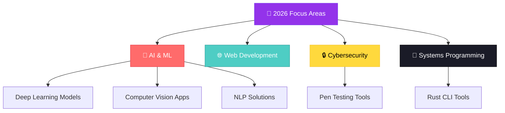

<!-- About Me Section -->
<div align="center">

## 👨‍💻 About Me


const ali: Developer = {
    name: "Ali Heydari",
    role: "Full-Stack Software Engineer",
    location: "🌍 Earth • Open to Remote Opportunities",
    
    currentFocus: [
        "🤖 Building AI-powered SaaS applications",
        "🦀 Mastering Rust for high-performance systems",
        "☁️ Architecting scalable cloud solutions",
        "🔐 Implementing security-first development practices"
    ],
    
    learning: [
        "Advanced Deep Learning & Neural Architecture",
        "Rust Systems Programming 
        "Web3 Technologies & Smart Contracts",
        "Advanced Cybersecurity & Ethical Hacking"
    ],
    
    languages: {
        expert: ["JavaScript", "Python"],
        proficient: ["PHP", "Rust", "SQL"],
        
    },
    
    expertise: {
        frontend: {
           
            "React"
        },
        backend: {
            node: ["Express.js",],
            python: ["FastAPI",],
        },
        database: {
            sql: ["PostgreSQL", "MySQL", "SQLite"],
            noSql: ["MongoDB",],
            orm: ["Prisma", ],
            
        },
        aiMl: ["PyTorch", "TensorFlow", "Scikit-Learn", "Hugging Face", "OpenCV"],
        devOps: ["Docker", "GitHub Actions", "Linux"],
        security: ["OWASP", "Penetration Testing", "Network Security", "Cryptography"]
    },
    
    interests: {
        technology: ["AI/Ml"],
        science: ["Neuroscience", "Biology", "Chemistry", "Physics"],
        data: ["Data Visualization", "Analytics", "Sports Analytics"],
        creative: ["Technical Writing", "Open Source"]
    },
};

// My approach to development
const codePhilosophy = () => {
    return {
        design: "Simple, scalable, and maintainable",
        code: "Clean, tested, and documented",
        deploy: "Secure, monitored, and optimized",
        mindset: "Always learning, always improving"
    };
};
```

<div align="center">

<!-- Featured Projects Section -->
<div align="center">

## 🚀 Featured Work


</div>

<table>
  <tr>
    <td width="50%" valign="top">
      
### 🔍 [BarcodeScannerAPI](https://github.com/Ali-hey-0/BarcodeScannerAPI)

<a href="https://github.com/Ali-hey-0/BarcodeScannerAPI">
  
</a>

**High-Performance Computer Vision API**

Production-ready barcode scanning service built with modern technologies for real-time processing and seamless integration.

**Tech Stack:**
<br>


</td>
<td width="50%" valign="top">


**🔨 In Development:**

<table>
<tr><td>

**🦀 Rust Systems**
- CLI Performance Monitor
- WebAssembly Game Engine
- Distributed Task Queue

</td></tr>
</table>

</td>
  </tr>
</table>

<br>

<!-- Project Roadmap -->
<div align="center">

### 💡 Development Roadmap


```mermaid
graph TB
    A[🎯 2026 Focus Areas] --> B[🤖 AI & ML]
    A --> C[🌐 Web Development]
    A --> D[🔒 Cybersecurity]
    A --> E[🦀 Systems Programming]
    
    B --> B1[Deep Learning Models]
    B --> B2[Computer Vision Apps]
    B --> B3[NLP Solutions] 

    D --> D2[Pen Testing Tools]
   
    
    E --> E1[Rust CLI Tools]
    style A fill:#9333EA,stroke:#7C3AED,color:#fff
    style B fill:#FF6B6B,stroke:#E63946,color:#fff
    style C fill:#4ECDC4,stroke:#35A29F,color:#fff
    style D fill:#FFD93D,stroke:#F4C430,color:#000
    style E fill:#1A1B27,stroke:#000000,color:#fff
```

</div>

---

<!-- Skills & Expertise Section -->
<div align="center">


<tr><td>

**💻 Master Technologies**
- [x] React 
- [x] Python for AI/ML
- [ ] Rust systems programming

</td></tr>
<tr><td>

**📦 Ship Products**
- [x] 1 production API
- [ ] 3+ web applications
- [ ] 5+ npm/cargo packages

</td></tr>
<tr><td>
</table>

</td>
<td width="50%" valign="top">

### 🌱 Personal Development

<table>
<tr><td>
### 🎨 Unique Approach

My interdisciplinary background fuels innovative solutions:

- **🧬 Biology** → Biomimetic algorithms & evolutionary optimization
- **⚗️ Chemistry** → Reaction modeling for distributed systems
- **🧠 Neuroscience** → Brain-inspired neural architectures
- **📊 Sports Analytics** → Data-driven decision frameworks
- **🌍 Geography**
</td>
</tr>
</table>

---

<!-- Status Section -->
<div align="center">

## 💼 Professional Status


<br><br>


<!-- Connect Section -->
<div align="center">

## 📫 Connect With Me


<br>

<a href="mailto:aliheydari1381doc@gmail.com">
  
</a>
<a href="https://linkedin.com/in/ali-heydari">
  
</a>
<a href="https://v1-artisan-ai-blog-le0gcynaxcvolwr-epspb.build-preview.cloudflare.dev">
  
</a>
<a href="https://github.com/Ali-hey-0">
  
</a>
<a href="https://twitter.com/ali_hey_0">
  
</a>

<br><br>

### 💌 Get In Touch

<table>
<tr>
<td align="center" width="33%">

**📧 Email**
<br>
[aliheydari1381doc@gmail.com](mailto:aliheydari1381doc@gmail.com)
<br><br>
*For professional inquiries*

</td>
<td align="center" width="33%">

**💼 LinkedIn**
<br>
[Ali Heydari](https://linkedin.com/in/ali-heydari)
<br><br>
*Let's connect professionally*

</td>
<td align="center" width="33%">

**📝 Blog**
<br>
[Tech Journey](https://v1-artisan-ai-blog-le0gcynaxcvolwr-epspb.build-preview.cloudflare.dev)
<br><br>
*Read my thoughts & tutorials*

</td>
</tr>
</table>
</div>

---

<!-- Quote Section -->
<div align="center">

## 💭 Daily Inspiration


</div>

---

<!-- Footer -->
<div align="center">


<br>

### 🌟 "The best code is written with passion, refined with discipline, and shared with generosity."

<br>


<br><br>


<br>

<table>
<tr>
<td align="center">

</td>
<td align="center">

</td>
<td align="center">

</td>
<td align="center">

</td>
</tr>
</table>

<br>

**⭐️ From [Ali-hey-0](https://github.com/Ali-hey-0) | Last Updated: January 2026 | Made with 💜 in Markdown**

<br>


</div>
