<div align="center">
  
  <!-- Animated Header with Gradient -->
  
  <br>

  <!-- Profile Statistics Badges -->
  <p align="center">
    <a href="https://github.com/Ali-hey-0?tab=followers">
      
    </a>
    
    
    
  </p>

  <!-- Focus Area Badges -->
  <p align="center">
    
    
    
  </p>
</div>

---

<div align="center">

## 🎯 Quick Navigation
**[👨‍💻 About](#-about-me)** • 
**[💼 Tech Stack](#-tech-stack)** • 
**[📊 GitHub Stats](#-github-statistics)** • 
**[🏆 Achievements](#-achievements--trophies)** • 
**[🚀 Projects](#-featured-projects)** • 
**[📫 Connect](#-lets-connect)**

</div>

---

<div align="center">

## 👨‍💻 About Me
</div>

```typescript
const ali: Developer = {
    name: "Ali Heydari",
    role: "Software Engineer",
    location: "🌍 Building from Earth",
    workingOn: "AI-powered applications with security focus",
    learning: ["Advanced ML", "Cloud Architecture", "Web3"],
    
    codeLanguages: {
        expert: ["JavaScript", "TypeScript", "Python"],
        intermediate: ["PHP", "Go", "Rust"],
        learning: ["Kotlin"]
    },
    
    techStack: {
        frontend: {
            frameworks: ["React", "Next.js"],
            styling: ["Bootstrap", "Material-UI", "TailwindCSS"],
            languages: ["HTML5", "CSS3", "JavaScript", "TypeScript"]
        },
        backend: {
            runtime: ["Node.js", "Express"],
            languages: ["Python", "PHP", "Go", "Rust"],
            frameworks: ["FastAPI", "Django"]
        },
        databases: ["MongoDB", "MySQL", "PostgreSQL", "Redis"],
        aiMl: ["PyTorch", "TensorFlow", "Scikit-Learn", "Pandas"],
        devOps: ["Docker", "Linux", "Git", "Bash", "CI/CD"],
        security: ["Kali Linux", "Network Security", "Penetration Testing"]
    },
    
    interests: {
        tech: ["AI/ML", "Cybersecurity", "Cloud Computing"],
        science: ["Biology", "Chemistry", "Neuroscience"],
        other: ["Geography", "Football", "Medical Science"]
    },
    
    currentChallenge: "Building the future, one commit at a time 🚀",
    funFact: "I debug with console.log() and I'm proud of it! 🐛"
};
```

---

<div align="center">

## 💼 Tech Stack

### 🎨 Frontend Technologies


### ⚙️ Backend & Server


### 🗄️ Databases & Storage


### 🤖 AI & Machine Learning


### 🛠️ DevOps & Tools


### 🔒 Cybersecurity


</div>

---

<div align="center">

## 📊 GitHub Statistics

<picture>
  <source media="(prefers-color-scheme: dark)" srcset="https://github-readme-stats.vercel.app/api?username=Ali-hey-0&show_icons=true&theme=tokyonight&hide_border=true&count_private=true&include_all_commits=true&card_width=495" />
  <source media="(prefers-color-scheme: light)" srcset="https://github-readme-stats.vercel.app/api?username=Ali-hey-0&show_icons=true&theme=default&hide_border=true&count_private=true&include_all_commits=true&card_width=495" />
  
</picture>

<picture>
  <source media="(prefers-color-scheme: dark)" srcset="https://github-readme-streak-stats.herokuapp.com/?user=Ali-hey-0&theme=tokyonight&hide_border=true&date_format=M%20j%5B%2C%20Y%5D" />
  <source media="(prefers-color-scheme: light)" srcset="https://github-readme-streak-stats.herokuapp.com/?user=Ali-hey-0&theme=default&hide_border=true&date_format=M%20j%5B%2C%20Y%5D" />
  
</picture>

<br><br>

<picture>
  <source media="(prefers-color-scheme: dark)" srcset="https://github-readme-stats.vercel.app/api/top-langs/?username=Ali-hey-0&theme=tokyonight&hide_border=true&layout=compact&langs_count=10&card_width=445" />
  <source media="(prefers-color-scheme: light)" srcset="https://github-readme-stats.vercel.app/api/top-langs/?username=Ali-hey-0&theme=default&hide_border=true&layout=compact&langs_count=10&card_width=445" />
  
</picture>

<picture>
  <source media="(prefers-color-scheme: dark)" srcset="https://github-profile-summary-cards.vercel.app/api/cards/productive-time?username=Ali-hey-0&theme=tokyonight&utcOffset=3.5" />
  <source media="(prefers-color-scheme: light)" srcset="https://github-profile-summary-cards.vercel.app/api/cards/productive-time?username=Ali-hey-0&theme=default&utcOffset=3.5" />
  
</picture>

<br><br>

### 📈 Contribution Graph


</div>

---

<div align="center">

## 🏆 Achievements & Trophies


</div>

---

<div align="center">

## 🚀 Featured Projects

<table>
  <tr>
    <td width="50%" valign="top">
      <h3 align="center">BarcodeScannerAPI</h3>
      <div align="center">
        <a href="https://github.com/Ali-hey-0/BarcodeScannerAPI" target="_blank">
          
        </a>
        <br><br>
        <p>
          
          
          
        </p>
        <p><strong>High-performance barcode scanning API</strong> - Built with Python and FastAPI for seamless integration and real-time processing.</p>
      </div>
    </td>
    <td width="50%" valign="top">
      <h3 align="center">More Projects Coming Soon! 🚀</h3>
      <div align="center">
        <br>
        <p align="center">
          
          
          
        </p>
        <br>
        <p><strong>Currently working on:</strong></p>
        <p>✨ AI-powered web applications</p>
        <p>🔒 Cybersecurity tools</p>
        <p>🌐 Full-stack solutions</p>
      </div>
    </td>
  </tr>
</table>

### 💡 What I'm Building

```mermaid
graph TB
    A[💻 Current Projects] --> B[AI & Machine Learning]
    A --> C[Web Development]
    A --> D[Cybersecurity]
    
    B --> B1[🤖 ML Models]
    B --> B2[🧠 Neural Networks]
    B --> B3[📊 Data Analytics]
    
    C --> C1[⚛️ React Apps]
    C --> C2[🚀 Next.js Sites]
    C --> C3[🎨 UI/UX Design]
    
    D --> D1[🔐 Security Tools]
    D --> D2[🛡️ Penetration Testing]
    D --> D3[🔍 Threat Analysis]
    
    style A fill:#9333EA,color:#fff
    style B fill:#FF6B6B,color:#fff
    style C fill:#4ECDC4,color:#fff
    style D fill:#FFD93D,color:#000
```


</div>

---

<div align="center">

## 🌟 Skills & Interests

</div>

<table>
  <tr>
    <td width="33%" valign="top">
      <h3>🎯 Currently Focused On</h3>
      - 🔭 Building <strong>AI-powered applications</strong><br>
      - 🌱 Mastering <strong>Advanced ML & Deep Learning</strong><br>
      - 👯 Open to <strong>Open Source contributions</strong><br>
      - 🤝 Seeking <strong>collaboration opportunities</strong><br>
      - 💬 Ask me about <strong>Full Stack Development</strong><br>
      - 🚀 Exploring <strong>Cloud Architecture & DevOps</strong><br>
      - 🔐 Learning <strong>Advanced Cybersecurity</strong>
    </td>
    <td width="33%" valign="top">
      <h3>🎨 Beyond Tech</h3>
      - 🌍 <strong>Geography</strong> - Exploring world cultures<br>
      - 🧬 <strong>Biology</strong> - Understanding life sciences<br>
      - ⚗️ <strong>Chemistry</strong> - Molecular interactions<br>
      - ⚽ <strong>Football</strong> - Strategy & analytics<br>
      - 📺 <strong>TV Series</strong> - Storytelling art<br>
      - 💊 <strong>Pharmacy</strong> - Medical innovations<br>
      - 🧠 <strong>Neuroscience</strong> - Brain functions
    </td>
    <td width="33%" valign="top">
      <h3>🎓 Always Learning</h3>
      - 📚 Reading technical books<br>
      - 🎯 Taking online courses<br>
      - 🏗️ Building side projects<br>
      - 🤝 Contributing to open source<br>
      - 📝 Writing technical blogs<br>
      - 🎤 Sharing knowledge<br>
      - 🌱 Growing every day
    </td>
  </tr>
</table>

<div align="center">
  <em>*These diverse interests fuel my creativity and bring unique perspectives to problem-solving!*</em>
</div>

---

<div align="center">

## 📫 Let's Connect

<p align="center">
  <a href="mailto:aliheydari1381doc@gmail.com">
    
  </a>
  <a href="https://linkedin.com/in/ali-heydari">
    
  </a>
  <a href="https://v1-artisan-ai-blog-le0gcynaxcvolwr-epspb.build-preview.cloudflare.dev">
    
  </a>
  <a href="https://github.com/Ali-hey-0">
    
  </a>
</p>

<br>

### 💼 Professional Status

<p align="center">
  
  
  
  
</p>

<br>

📧 **Email:** [aliheydari1381doc@gmail.com](mailto:aliheydari1381doc@gmail.com)  
💼 **LinkedIn:** [Ali Heydari](https://linkedin.com/in/ali-heydari)  
📝 **Blog:** [Tech Journey & Insights](https://v1-artisan-ai-blog-le0gcynaxcvolwr-epspb.build-preview.cloudflare.dev)  
🐙 **GitHub:** [Ali-hey-0](https://github.com/Ali-hey-0)

</div>

---

<div align="center">

## 💭 Developer Wisdom


</div>

---

<div align="center">

## 🎯 2026 Goals & Vision

</div>

```yaml
Professional Goals:
  Technical Mastery:
    - Deep Learning & Advanced AI/ML
    - Cloud Architecture (AWS, Azure, GCP)
    - System Design & Scalability
    - Advanced Cybersecurity Techniques
    - Rust Systems Programming

  Project Goals:
    - Launch: 5+ AI-powered applications
    - Build: Personal SaaS product
    - Contribute: 10+ Major open source projects
    - Create: Technical course or tutorial series
  
  Learning Path:
    - Languages: [Kotlin, WebAssembly]
    - Technologies: [Kubernetes, GraphQL, Substrate]
    - Concepts: [Microservices, Serverless, Edge Computing]

Personal Development:
  Knowledge Sharing:
    - Write: 50+ technical blog posts
    - Create: YouTube tutorials
    - Speak: At tech conferences
    - Mentor: Junior developers
  
  Community:
    - Network: Connect with global tech community
    - Collaborate: Work on impactful projects
    - Share: Open source contributions
    - Learn: From industry experts

Life Balance:
  - Read: 24 technical books
  - Exercise: Regular physical activity
  - Explore: New technologies and frameworks
  - Enjoy: Diverse interests beyond tech
```

---

<div align="center">

### ⚡ Fun Facts

<table>
  <tr>
    <td width="60%" valign="center">
      
**When I'm not coding:**
- 🌍 Exploring the intersection of geography and data visualization
- 🧬 Reading about biomimicry and its applications in software design
- ⚗️ Following breakthroughs in chemistry and materials science
- ⚽ Analyzing football strategies using data analytics
- 🧠 Learning about neuroscience and cognitive psychology
- 💊 Staying updated on pharmaceutical innovations

**My Unique Approach:**
> I believe that the best solutions come from diverse perspectives. My interests in biology, chemistry, and medicine often inspire creative approaches to technical problems—whether it's applying neural network concepts inspired by actual neurons or using chemical reaction patterns to optimize algorithms!

</td>
<td width="40%" align="center">
  
  <br><br>
  
  <br>
  
  <br>
  
</td>
  </tr>
</table>

</div>

---

<div align="center">

## 📊 Weekly Development

<!--START_SECTION:waka-->
<!--END_SECTION:waka-->
<sub>*Tracking my coding activity with WakaTime*</sub>

</div>

---

<div align="center">

## 🚀 Let's Build Something Amazing Together!


<br><br>

**I'm eager to collaborate on:**
- 🤖 AI/ML projects and research
- 🌐 Full-stack web applications
- 🔒 Cybersecurity tools and solutions
- 📱 Mobile app development
- 🔧 Open source contributions
- 💡 Innovative tech startups

<br>

### 📬 Get In Touch

**Have a project idea? Want to collaborate? Or just want to chat about tech?**
Drop me an email at **[aliheydari1381doc@gmail.com](mailto:aliheydari1381doc@gmail.com)**

*Let's turn ideas into reality! 🚀*

</div>

---

<div align="center">


<br>

**"The only way to do great work is to love what you do." – Steve Jobs**
<br>

<p align="center">
  
  
</p>

<br>


<sub>⭐️ From [Ali-hey-0](https://github.com/Ali-hey-0) | Last updated: 2026</sub>
</div>
```
